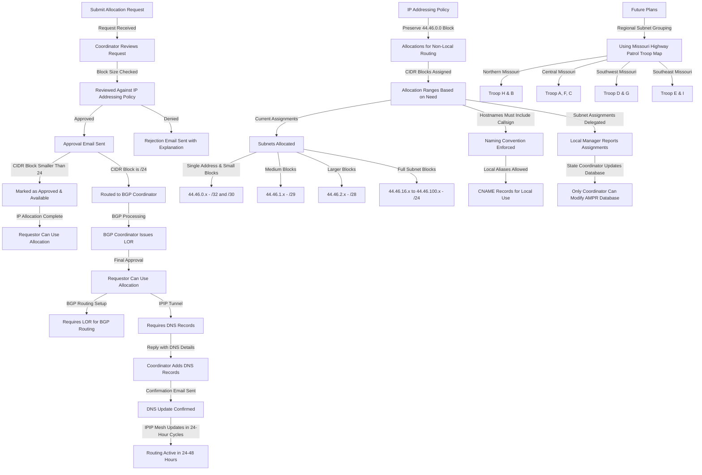

## Process Flowchart

```mermaid
graph TD;
  %% Main Process: Allocation Request %%
  A[Submit Allocation Request] -->|Request Received| B[Coordinator Reviews Request]

  B -->|Block Size Checked| C[Reviewed Against IP Addressing Policy]

  C -->|Approved| D[Approval Email Sent]
  C -->|Denied| E[Rejection Email Sent with Explanation]

  D -->|CIDR Block Smaller Than 24| F[Marked as Approved & Available]
  F -->|IP Allocation Complete| G[Requestor Can Use Allocation]

  D -->|CIDR Block is /24| H[Routed to BGP Coordinator]
  H -->|BGP Processing| I[BGP Coordinator Issues LOR]
  I -->|Final Approval| J[Requestor Can Use Allocation]

  %% DNS & IPIP Tunnel Handling %%
  J -->|BGP Routing Setup| K[Requires LOR for BGP Routing]
  J -->|IPIP Tunnel| L[Requires DNS Records]

  L -->|Reply with DNS Details| M[Coordinator Adds DNS Records]
  M -->|Confirmation Email Sent| N[DNS Update Confirmed]
  N -->|IPIP Mesh Updates in 24-Hour Cycles| O[Routing Active in 24-48 Hours]

  %% IP Addressing Policy %%
  P[IP Addressing Policy] -->|Preserve 44.46.0.0 Block| Q[Allocations for Non-Local Routing]

  Q -->|CIDR Blocks Assigned| R[Allocation Ranges Based on Need]

  R -->|Current Assignments| S[Subnets Allocated]
  S -->|Single Address & Small Blocks| T[44.46.0.x - /32 and /30]
  S -->|Medium Blocks| U[44.46.1.x - /29]
  S -->|Larger Blocks| V[44.46.2.x - /28]
  S -->|Full Subnet Blocks| W[44.46.16.x to 44.46.100.x - /24]

  R -->|Hostnames Must Include Callsign| X[Naming Convention Enforced]
  X -->|Local Aliases Allowed| Y[CNAME Records for Local Use]

  R -->|Subnet Assignments Delegated| Z[Local Manager Reports Assignments]
  Z -->|State Coordinator Updates Database| AA[Only Coordinator Can Modify AMPR Database]

  %% Future Considerations %%
  AB[Future Plans] -->|Regional Subnet Grouping| AC[Using Missouri Highway Patrol Troop Map]
  AC -->|Northern Missouri| AD[Troop H & B]
  AC -->|Central Missouri| AE[Troop A, F, C]
  AC -->|Southwest Missouri| AF[Troop D & G]
  AC -->|Southeast Missouri| AG[Troop E & I]
```

